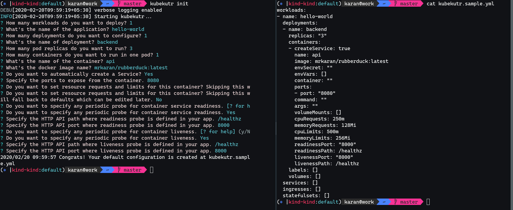

<a href="https://zerodha.tech"></a>

# kubekutr


🍪✂️ _Cookie cutter for Kubernetes resource manifests_

(_Pronounced as "cube cutter"_)

`kubekutr` lets you quickly scaffold a [bespoke](https://kubernetes-sigs.github.io/kustomize/api-reference/glossary/#bespoke-configuration) configuration for Kubernetes resource manifests with an _opinionated_ GitOps directory structure. `kubekutr` is ideally meant to be used in combination with [kustomize](https://github.com/kubernetes-sigs/kustomize).



## Motivation

`kustomize` is a great tool when it comes to declarative application management for manifests. There still exists a lot of manual scaffolding to create a [base](https://kubernetes-sigs.github.io/kustomize/api-reference/glossary/#base) which defines your application state. `kubekutr` aims to solve the issue of writing these manifests manually by providing a very simple Go template rendering engine.

Read the blog [post](https://mrkaran.dev/posts/introducing-kubekutr/) for more information.

### Non Goals

`kubekutr` doesn't aim to provide all 1000s of options of templating `yaml` files. More users mean every user will want to customise the `yaml` in some way or the other and this is where `kustomize` comes into picture. Users of `kubekutr` are encourage to use `kustomize` to create _variants_ on top of `bases` to apply any kind of customisation. `kubekutr`'s **only** goal is to create the _base_ directory.

## Installation

### Using snap

[](https://snapcraft.io/kubekutr)

```sh
$ sudo snap install kubekutr
```

### Grab the latest binary

```shell
$ cd "$(mktemp -d)"
$ curl -sL "https://github.com/mr-karan/kubekutr/releases/download/0.8.2/kubekutr_0.8.2_$(uname)_amd64.tar.gz" | tar xz
$ mv kubekutr /usr/local/bin
# kubekutr should be available now in your $PATH
$ kubekutr --version
```

## Usage

```shell
NAME:
   kubekutr - Cookie cutter for Kubernetes resource manifests

USAGE:
   kubekutr [global options] command [command options] [arguments...]

VERSION:
   4175090 (2020-02-06 18:03:26 +0530)

AUTHOR:
   Karan Sharma @mrkaran

COMMANDS:
   scaffold, s  Scaffold a new project with gitops structure
   init, i      Initialize a new project. Initializes git repo and a sample config file.
   help, h      Shows a list of commands or help for one command

GLOBAL OPTIONS:
   --verbose                 Enable verbose logging
   --config value, -c value  path to one or more config files
   --help, -h                show help
   --version, -v             print the version
```

### Initialise a new project

- **Using Prompt**

`kubekutr init`

[](https://asciinema.org/a/303176)

- **Using default config**

`kubekutr init --default`

Either of these options create a config file `kubekutr.yml` in your current working directory. You can edit this file further to suit your needs and scaffold a project using this.

- **Define output file**

`kubekutr init -o <filename.yml>`

Override the default config filename.

### Scaffold a new project

```bash
# create a new base

$ kubekutr --config kubekutr.yml scaffold -o myproject

# `myproject` is created with the GitOps structure
myproject
`-- base
    |-- app
    |   |-- app-deployment.yml
    |   |-- app-ingress.yml
    |   |-- app-service.yml
    |-- second-app
        |-- db-statefulset.yml
```

#### Generate kustomization.yml

If you'd like to generate a super simple, default `kustomization.yml` in `base` folder at the time of scaffolding, you can specify `--kustomize` or `-k` with `scaffold`:

```sh
kubekutr --config kubekutr.yml scaffold -o myproject -k
```

```yml
resources:
  - app/app-service.yml
  - app/app-deployment.yml
  - app/app-service.yml
  - app/app-ingress.yml
  - second-app/db-statefulset.yml
```

## Configuration

You can see a sample configuration file [here](templates/config.sample.yml).

- **workloads**
    -   **name**: Name of the workload. A workload represents the complete set of resources required to deploy an application
    -   **deployments**
        -   **name**: Name of the deployment
        -   **replicas**: Represents the number of replicas for a `Pod`
        -   **labels**:
            - **name**: Represent the key value pair as a string. For eg: `"app.kubernetes.io/tier: cache"`
        -   **containers**: List of containers in a Pod
            - **name**: Unique name for a container
            - **image**: Docker image name
            -   **ports**:
                - **name**: Unique identifier for the port.
                - **port**: Port address/name for port exposed on container.
                - **createService**: (_False/True_): Automatically create a `Service` manifest based on the port settings of container.
            - **command**: Entrypoint array
            - **args**: Arguments to the entrypoint
            - **envVars**: List of environment variables to set in the container
                - **name**: Name of environment variable
                - **value**: Value of environment variable
            - **volumeMounts**: Pod volumes to mount into the container's filesystem
                - **name**: Name of Volume
                - **mountPath**: Path within the container at which the volume should be mounted
                - **subPath**: Path within the volume from which the container's volume should be mounted.
        -   **volumes**: List of volumes defined for a deployment
                - **name**: Name of Volume

    -   **statefulsets**
        -   **name**: Name of the statefulset
        -   **serviceName**: serviceName is the name of the service that governs this StatefulSet
        -   **labels**: (reference above)
        -   **containers**: (reference above)
        -   **volumes**:(reference above)

    -   **services**
        -   **name**: Name of service
        -   **type**: Type of service. Can be one of `ClusterIP`, `NodePort`, `LoadBalancer`
        -   **ports**:
            - **name**: Unique identifier for the port.
            - **port**: Port address/name for port exposed on container.
            - **targetPort**: Number or name of the port to access on the pods targeted by the service
            - **protocol**: Defaults to TCP. (Can be either _TCP/UDP_)
        -   **labels**: (reference above)
        -   **selectors**:
            - **name**:  Route service traffic to pods with label keys and values matching this selector

    -   **ingresses**
        -   **name**: Name of ingress
        -   **ingressPaths**
            -   **path**: Path which map requests to backends
            -   **service**: Specifies the name of the referenced service
            -   **port**: Specifies the port of the referenced service
        -   **labels**: (reference above)
        -   **annotations**:
            - **name**:  Annotations is an unstructured key value map stored with a resource that may be set by external tools to store and retrieve arbitrary metadata

## ⭐️ Show your support

Give a ⭐️ if this project helped you!

## Contributing

This is still an alpha release. For a full list of things to improve, see unchecked items in [TODO](TODO.md).
Contributions welcome!
